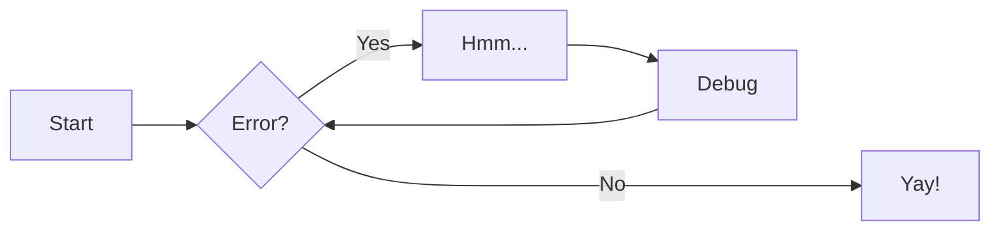

# MkDocs
Requirements to run MkDocs:
`Python 3.x`

More source material
 [MkDocs wiki](https://www.mkdocs.org/)

[Material for MkDoc](https://squidfunk.github.io/mkdocs-material/)

## What is MkDocs
MkDocs is a fast and straightforward static site generator that allows users to build project documentation with ease. It is commonly used for creating user-friendly
documentation for software projects, APIs, and other similar resources. MkDocs operates on Markdown files,
enabling developers to focus on writing content without worrying about of HTML or CSS. This tool is highly customizable,
offering various themes and extensions to tailor the documentation's appearance and functionality. With its user-friendly
interface and seamless integration with version control systems, MkDocs is a popular choice for teams looking to create professional and accessible documentation for their projects.

## Material for MkDocs
Material for MkDocs is a popular theme that enhances the visual appeal and user experience of documentation generated by MkDocs. Inspired by Google's Material Design,
this theme provides a modern and polished look to project documentation, making it more engaging and accessible for users.
Material for MkDocs integrates sleek design elements, such as responsive layouts, customizable navigation, and a clear typography hierarchy, to create an intuitive and aesthetically pleasing documentation site.
This theme also supports various customization options, allowing users to fine-tune the appearance of their documentation to suit their specific branding and style preferences. With its emphasis on usability and visual appeal,
Material for MkDocs is a favored choice for developers and teams seeking to elevate the presentation of their project documentation.

## How to run MkDocs
Project Initialization: Create a new MkDocs project using the following command:

```
mkdocs new my-project
```

Content Creation: Add your documentation content in Markdown format to the docs/ directory within your project. Organize your files and folders to reflect the structure of your documentation.

Preview Locally: To preview your documentation site locally, use the following command:

```
mkdocs serve
```
This command will launch a development server, allowing you to view your documentation website in your web browser at http://localhost:8000.

Build: Once you are satisfied with the changes, build the static site using the following command:

```
mkdocs build
```
This command generates a static HTML site in the site/ directory, ready for deployment.

The mkdocs workflow handles the deployment to gh-pages. However, if one may need to generate it manually the command:

```
mkdocs gh-deploy
```
Creates a mkdocs branch and pushes the code to gh-pages.

NOTE!!!
This way is not recommended if one want to follow the docs-as-code philosophy, the md files should be pushed with a pr, tested and code reviewed before deployed.

## Formatting, grids, icons etc.
With material for MkDocs you can create a lot of different references (math, diagrams, grids).

Some examples including

Flowcharts:


Data tabels:

| Method      | Description                          |
| ----------- | ------------------------------------ |
| `GET`       | :material-check:     Fetch resource  |
| `PUT`       | :material-check-all: Update resource |
| `DELETE`    | :material-close:     Delete resource |

Images:

{ width="300" }

Please read [this](https://squidfunk.github.io/mkdocs-material/reference/) for more information about references
## Configuring MkDocs
In the `mkdocs.yml` file situated in the root of the wiki one could add or remove features of MkDocs. We recommend using the plugins provided to streamline all Greenhouse projects with same template.

To add headers and files, the `nav:` needs to be updated. Here you can see how this wiki is structured.

```yaml
nav:
  - Home: 'index.md'
  - MkDocs:
    - 'Writing MkDocs': 'MkDocs/mkdocs-writing.md'
    - 'CI/CD With MkDocs': 'MkDocs/mkdocs-ci.md'
  - CI/CD:
    - 'Contiuous Integration': 'CI/ci.md'
    - 'Continious Delivery': 'CI/cd.md'
  - Git prehooks:
    - 'prehooks': 'git/prehooks.md'
  - GitHub:
    - Issues: 'github/issues.md'
    - Project board: 'github/projectboard.md'
    - GitHub Actions: 'github/actions.md'
    - Copilot: 'github/copilot.md'
    - Automated notifications: 'github/notifications.md'
  - Meetings:  'meetings/meetings.md'
```

We recommend using folders to keep the md files organized. If the project contains many folders, a good rule of thumb is
to have a md file for every folder, explaining what the folder contains

For more information about plugins, please read the documentation provided: [squidfunk](https://squidfunk.github.io/mkdocs-material/plugins/)


## Url routing
The url routing is based on where the md file is situated. For example, the file ```MkDocs/mkdocs-writing.md ``` will pass the routing  ``` http://127.0.0.1:8000/MkDocs/mkdocs-writing/``` . This is another reason why keeping the is seperate folders 
less complex to understand. Also, having multiple files under same `nav:` routing to the different markdown files will be created. See picture below where `Writing MkDocs` and `CI/CD with MkDocs` are different routed.

